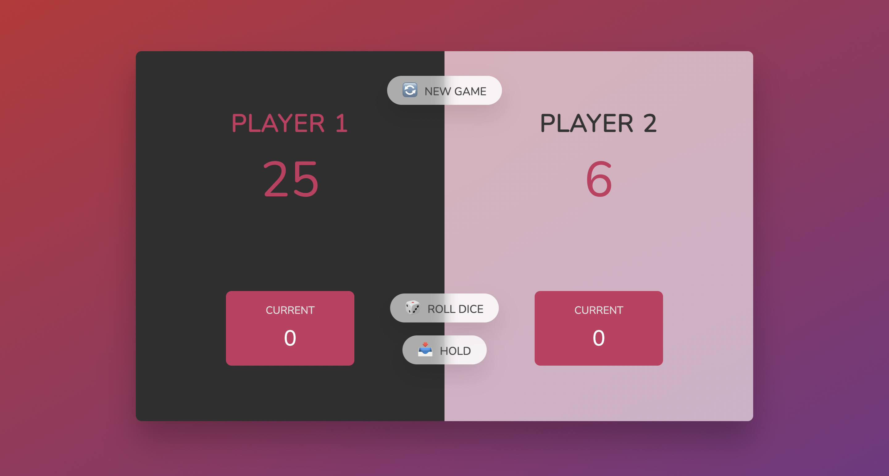

#DiceRollingGame
This game is a simple dice-rolling game implemented using JavaScript and DOM manipulation. The objective is for two players to take turns rolling a dice to accumulate points. The first player to reach a score of 20 wins.

Here’s how it works:

Two players take turns rolling a dice. If the dice shows a number other than 1, the player can accumulate the value into their current score. If 1 is rolled, the turn passes to the other player.
Players can choose to "hold" their current score, adding it to their total score, and pass the turn.
The game ends when a player’s total score reaches or exceeds 20.
There are buttons to roll the dice, hold the score, and reset the game.
The game keeps track of scores, switches players, and displays visual indicators for the active player and the winner.

